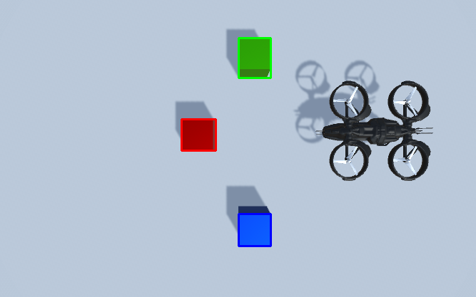

<div align="center">

# 🚁 Vision Drone Sorter

### Autonomous drone that sees colored cubes and sorts them — Unity simulation driven by real-time OpenCV computer vision

[](https://unity.com/)
[](https://www.python.org/)
[](https://opencv.org/)
[](https://learn.microsoft.com/dotnet/csharp/)
[](LICENSE)

</div>

---

## 🎬 Demo

<div align="center">

https://github.com/tathagata48/vision-drone-sorter/raw/main/demo.mp4

<sub><i>▶ If the player above doesn't load, <a href="demo.mp4">download / watch the demo here</a>.</i></sub>

</div>

---

## 📖 Overview

**Vision Drone Sorter** is a closed-loop robotics simulation that combines **computer vision** with an **autonomous aerial agent**. A virtual drone in Unity surveys a scene of scattered colored cubes, a Python vision pipeline identifies each cube by color, and the drone then autonomously picks up every cube and delivers it to its matching drop-off zone.

It demonstrates a complete **perception → decision → actuation** loop:

```
Unity Camera  ──►  Screenshot  ──►  OpenCV Detection  ──►  TCP Command  ──►  Drone Picks & Sorts
   (sense)          (capture)         (perceive)            (decide)            (act)
```

The Unity engine handles physics, the drone, and the world; Python + OpenCV act as the "brain" that perceives the environment and issues commands over a TCP socket.

---

## ✨ Features

- 🎥 **Vision-based perception** — captures the live scene and detects red, green, and blue cubes using HSV color segmentation.
- 🧠 **Color counting & classification** — counts how many cubes of each color exist and tags each detection.
- 🔌 **Real-time TCP bridge** — Python and Unity communicate over a lightweight socket protocol on `localhost`.
- 🚁 **Autonomous pick-and-place** — the drone lifts, navigates, grips, transports, and drops each cube at its color-matched zone.
- ♻️ **Sequential task queue** — commands are queued and executed safely on Unity's main thread, one cube at a time.
- 📸 **In-engine screenshot capture** — a dedicated camera renders the scene to an image for the vision pipeline.

---

## 🖼️ How It Works

| Stage | Component | Description |
|-------|-----------|-------------|
| **1. Capture** | `Takephoto.cs` | A Unity camera renders the scene to a PNG screenshot. |
| **2. Perceive** | `main.py` (OpenCV) | The image is converted to HSV; red / green / blue masks isolate the cubes, contours are extracted, and each cube is counted and classified. |
| **3. Decide** | `main.py` (socket client) | For each detected color, a command is sent to Unity over TCP port `65431`. |
| **4. Act** | `DroneMovement.cs` | Unity receives the color command, then runs a coroutine that flies the drone to the cube, grips it, and drops it at the matching zone. |
| **5. Grip** | `pickdrop.cs` | Handles parenting the cube to the drone's gripper and releasing it on drop. |

### Detection result

The vision pipeline annotates each detected cube with a colored bounding box:

<div align="center">
  
</div>

---

## 🗂️ Project Structure

```
vision-drone-sorter/
├── Assets/
│   ├── Scenes/
│   │   ├── CVSystem.unity          # Main simulation scene
│   │   └── SampleScene.unity
│   ├── Scripts/
│   │   ├── DroneMovement.cs        # TCP listener + autonomous flight & pick-and-place
│   │   ├── Takephoto.cs            # In-engine camera screenshot capture
│   │   ├── pickdrop.cs             # Gripper attach / release logic
│   │   └── main.py                 # (reference copy of the vision script)
│   ├── Materials/ · Textures/ · Images/
│   └── Military Cargo Aircraft/    # Drone / aircraft model assets
├── ProjectSettings/                # Unity project configuration
├── Packages/                       # Unity package manifest
├── main.py                         # Python OpenCV detection + drone controller
├── requirements.txt                # Python dependencies
├── detected_cards_colored.png      # Sample detection output
├── demo.mp4                        # Demo recording
└── README.md
```

---

## 🚀 Getting Started

### Prerequisites

- **Unity 2020.3.17f1** (or compatible 2020.3 LTS) — install via [Unity Hub](https://unity.com/download)
- **Python 3.8+**

### 1. Clone the repository

```bash
git clone https://github.com/tathagata48/vision-drone-sorter.git
cd vision-drone-sorter
```

### 2. Set up the Python environment

```bash
python -m venv venv
# Windows
venv\Scripts\activate
# macOS / Linux
source venv/bin/activate

pip install -r requirements.txt
```

### 3. Open the Unity project

1. Open **Unity Hub → Add → select this project folder**.
2. Open the scene `Assets/Scenes/CVSystem.unity`.
3. Press **▶ Play**. The drone spins up a TCP server on port `65431` and waits for commands.

### 4. Run the vision pipeline

With Unity in Play mode, capture a screenshot of the scene (the `Takephoto` capture button), then run:

```bash
python main.py
```

> **Note:** Update the `image_path` in `main.py` to point at your captured screenshot. The script detects each cube, prints the per-color counts, and streams sorting commands to the running Unity simulation.

---

## 🧩 Communication Protocol

A minimal text protocol over TCP keeps the two worlds in sync:

| Field | Value |
|-------|-------|
| Host | `localhost` |
| Port | `65431` |
| Payload | One of `red`, `green`, `blue` (ASCII) |
| Behaviour | Unity ignores new commands while the drone `isBusy`, ensuring one clean pick-and-place at a time |

---

## 🛠️ Tech Stack

- **Unity 2020.3 LTS** — 3D environment, physics, drone agent, coroutine-based motion
- **C#** — Unity scripting (networking, flight control, gripper)
- **Python 3** — orchestration & vision
- **OpenCV** — HSV color segmentation & contour detection
- **NumPy** — array / mask operations
- **TCP Sockets** — inter-process communication between Python and Unity

---

## 📜 License

Distributed under the **MIT License**. See [`LICENSE`](LICENSE) for details.

---

<div align="center">
<sub>Built with Unity, OpenCV, and a lot of hovering. ⚙️🚁</sub>
</div>
